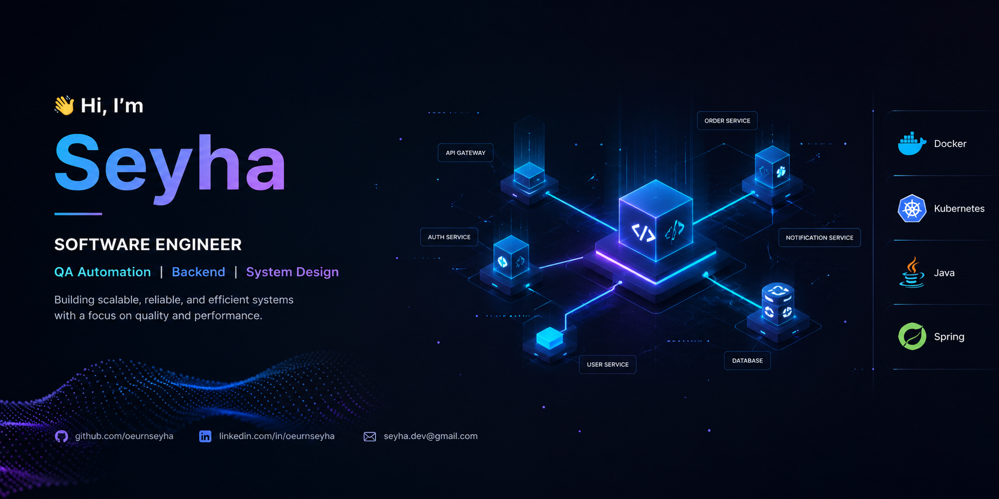

---

I build scalable, production-ready applications with a strong focus on **quality, performance, and clean architecture**.

---

## 🧠 About Me
- 💻 Focused on **Full-Stack Development & QA Automation**
- ⚙️ Experienced in **ReactJS, NextJS, Typescript, springboot, NodeJs**
- 🧪 Strong in **Test Automation (Karate Framewrok, Appium, Roobot, Katalon, K6, Jmeter, WebDriverIO Playwright, API Testing, CI/CD)**
- 🏦 Interested in **Banking Systems, Telecommunications, Distributed Systems, and High-Availability Architectures**

---

## 🛠️ Tech Stack

### 🎨 Frontend

---

### ⚙️ Backend

---

### 🧪 Testing & QA

---

### 🚀 DevOps & Infrastructure

---
### 🔐 Security & Observability monitoring

---

### 🚀 Platform & Cluster Management

⭐ **"Clean code. Strong testing. Scalable systems."**
